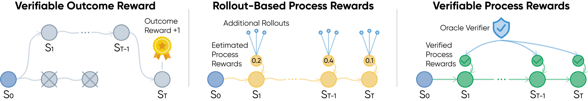
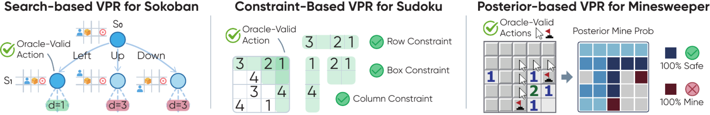
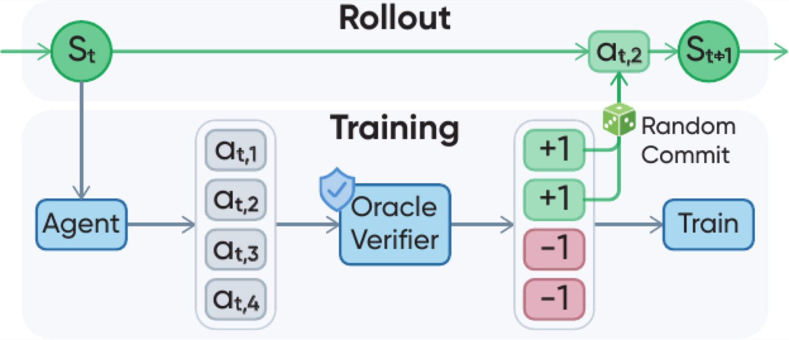

# Verifiable Process Rewards for Agentic Reasoning

[](https://arxiv.org/abs/2605.10325)
[](https://thu-nics.github.io/VPR/)
[](https://huggingface.co/collections/nics-efc/vpr)
[](LICENSE)

This repository contains the implementation of **Verifiable Process Rewards
(VPR)** on top of [verl-agent](https://github.com/langfengQ/verl-agent) and
[veRL](https://github.com/volcengine/verl).

## Overview

<p align="center">
  
</p>
<p align="center"><em>Outcome rewards supervise completed trajectories; rollout-based process rewards estimate intermediate values from additional continuations; VPR directly scores intermediate actions with a task-solving oracle.</em></p>

Reinforcement learning from verifiable rewards can optimize objective task
outcomes, but terminal-only feedback leaves a substantial credit-assignment
problem in long-horizon interaction. Learned judges may be noisy or exploitable,
while continuation-based value estimates require additional rollouts from
intermediate states.

VPR studies structured agentic reasoning problems that admit symbolic or
algorithmic task-solving oracles. It repurposes each oracle as an **action-level
process verifier**: oracle-preferred actions receive the highest reward, while
other legal or invalid policy actions receive lower rewards.

## Method

We instantiate VPR with three types of task-grounded verifier:

- **Sokoban:** breadth-first search identifies actions on a shortest solution path.
- **Sudoku:** constraint structure distinguishes forced, MRV, legal non-oracle,
  wrong, and invalid moves.
- **Minesweeper:** posterior mine probabilities identify safe reveals, certain
  flags, and minimum-risk guesses.

<p align="center">
  
</p>
<p align="center"><em>Three VPR instantiations, in visual order: search-based Sokoban, constraint-based Sudoku, and posterior-based Minesweeper.</em></p>

### State-group rollout and optimization

- **Oracle-guided state-group rollout.** At every visited state, the policy
  independently samples four candidate responses. The constructed verifier
  scores and ranks their parsed actions, and one uniformly sampled maximum-reward
  candidate is committed to the environment. Best-of-four commit improves
  exploration of promising states while inducing an oracle-guided shift in the
  visited-state distribution.
- **Locally normalized optimization.** The four same-state candidates form a
  state group. Every informative, non-padding candidate can train the policy.
  VPR first centers rewards within the group and then whitens across valid
  candidates; equal-reward groups are skipped because they contain no local
  preference signal.

<p align="center">
  
</p>
<p align="center"><em>Candidate sampling and training are distinct from the single committed environment transition.</em></p>

## Results

| Method | Sokoban SR (%) | Sudoku SR (%) | Sudoku CR (%) | Minesweeper SR (%) | Minesweeper CR (%) |
|:--|--:|--:|--:|--:|--:|
| *Optimal* | *100.00 ± 0.00* | *100.00 ± 0.00* | *100.00 ± 0.00* | *78.60 ± 3.78* | *96.93 ± 0.77* |
| Base | 5.20 ± 3.35 | 0.00 ± 0.00 | 4.10 ± 0.39 | 0.20 ± 0.45 | 71.04 ± 2.00 |
| GRPO | 12.20 ± 1.10 | 29.00 ± 3.46 | 39.03 ± 3.44 | 4.20 ± 1.30 | 73.49 ± 2.04 |
| VinePPO | 6.80 ± 1.30 | 0.00 ± 0.00 | 2.90 ± 0.44 | 3.00 ± 2.24 | 72.75 ± 1.59 |
| **VPR (Ours)** | **28.40 ± 2.79** | **80.60 ± 4.16** | **84.22 ± 3.15** | **32.60 ± 5.03** | **85.76 ± 0.98** |

<p align="center"><em>SR denotes success rate; CR denotes completion rate. Results are mean ± sample standard deviation over five runs of 100 games. Optimal directly executes the task oracle under the same environments and action budgets. Minesweeper still requires minimum-risk guesses in uncertain states.</em></p>

- In controlled Qwen3-4B experiments, VPR outperforms GRPO and VinePPO on every
  reported metric across Sokoban, Sudoku, and Minesweeper.
- Mixed OOD experiments start from the same Qwen3-4B-Base checkpoint and hold
  math-data exposure fixed. Math+VPR achieves the best average over seven
  general-reasoning benchmarks and the strongest ALFWorld and WebShop results.
- The OOD comparison does not claim equal total rollout compute.

## Installation

The paper environment used Python 3.12, PyTorch 2.8, vLLM 0.11, Ray 2.50,
Transformers 4.57.3, and tensordict 0.10 on CUDA 12. Install platform-compatible
PyTorch and vLLM wheels first, following the upstream verl-agent instructions.

```bash
git clone https://github.com/thu-nics/VPR.git
cd VPR
pip install -e ".[vllm,vpr]"

# Development and CPU tests.
pip install -e ".[test]"
```

For the paper-compatible core package versions, add:

```bash
pip install -c constraints/vpr-training-py312-cu12.txt -e ".[vllm,vpr]"
```

The constraints file records the validated server configuration; it is not a
portable CUDA installer. Compared with upstream verl-agent, the principal VPR
dependency is the pinned `gem-llm` package. Sokoban additionally uses the
upstream-supported `gym-sokoban` environment.

## Quick start

All launchers require an explicit local or Hugging Face model path. Generated
data and run artifacts stay under repository-relative ignored directories.

```bash
export MODEL_PATH=/path/to/Qwen3-4B

python examples/vpr_games/prepare_data.py \
  --env-name vpr_sokoban --train-size 64 --val-size 64 \
  --output-dir examples/vpr_games/data/vpr_sokoban

# Paper VPR configurations: 64 initial tasks, K=4 candidates per visited state.
bash examples/vpr_games/vpr/vpr_sokoban.sh
bash examples/vpr_games/vpr/vpr_sudoku.sh
bash examples/vpr_games/vpr/vpr_minesweeper.sh
```

Useful overrides include `RUN_DIR`, `CUDA_VISIBLE_DEVICES`, `N_GPUS`,
`TP_SIZE`, `TRAIN_STEPS`, `TRAIN_BATCH`, `ROLLOUT_N`, and `RESUME_MODE`.
Set `DRY_RUN=1` to validate a paper-facing launcher without starting training.

## Baselines

```bash
# Outcome-reward GRPO: 32 task instances x 8 complete trajectories.
bash examples/vpr_games/grpo/grpo_sokoban_outcome.sh
bash examples/vpr_games/grpo/grpo_sudoku_outcome.sh
bash examples/vpr_games/grpo/grpo_minesweeper_outcome.sh

# VinePPO.
bash examples/vpr_games/vineppo/vineppo_sokoban.sh
bash examples/vpr_games/vineppo/vineppo_sudoku.sh
bash examples/vpr_games/vineppo/vineppo_minesweeper.sh
```

TicTacToe and Turn-level PPO remain available as additional/legacy
implementations, but they are not part of the paper's main experimental suite.

## Mixed training and evaluation

The mixed comparison holds math exposure fixed at 64 math prompts with eight
responses each. Math+VPR uses 6/8/18 initial Sokoban/Sudoku/Minesweeper prompts
with four candidates at every visited state. Math+GRPO uses 3/4/9 prompts with
eight complete trajectories per prompt. This matches first-decision response
counts, not total sequential rollout compute.

```bash
bash examples/dapo_trainer/run_qwen3_4b_base_math.sh
bash examples/dapo_trainer/run_qwen3_4b_base_vpr_mixed.sh
bash examples/dapo_trainer/run_qwen3_4b_base_games_non_vpr_mixed.sh

cp examples/vpr_games/eval/in_domain_checkpoints.example.env runs/in_domain_checkpoints.env
# Edit the copied paths before sourcing it.
source runs/in_domain_checkpoints.env
MODEL_PATH=/path/to/Qwen3-4B bash examples/vpr_games/eval/eval_in_domain_all.sh
MODEL_MANIFEST=/path/to/models.tsv bash examples/vpr_games/eval/eval_reasoning_all.sh
MODEL_MANIFEST=/path/to/models.tsv bash examples/vpr_games/eval/eval_agentic_ood_all.sh
```

Evaluation launchers preserve protocol manifests, raw generations, source
identity, and resumability under `runs/`. See
[`examples/vpr_games/eval/README.md`](examples/vpr_games/eval/README.md).

## Exploratory evaluation on τ²-bench

When a compact symbolic oracle is unavailable, we explore whether a task-grounded
expert reference policy can supply VPR-style action rewards at student-visited
states. The reference policy receives privileged task specifications, evaluation
criteria, and reference-resolution guidance. Tool actions use canonical exact
matching; natural-language actions use a semantic matcher. The expert is used
only during training.

Under this protocol, VPR outperforms GRPO on held-out Airline and Retail tasks.

**Evidence boundary.** Airline and Retail provide exploratory evidence that
privileged expert guidance can supply useful action-level supervision, including
on held-out tasks. Telecom is mixed, so this experiment does not establish
uniform transfer to a new tool domain or a general reference-policy-to-verifier
conversion.

```bash
PYTHON=python bash examples/tau_bench/install_tau2.sh
export OPENROUTER_API_KEY=...
MODEL_PATH=/path/to/Qwen3-8B bash examples/tau_bench/run_tau_vpr.sh
```

Both trained τ²-bench variants are evaluated at step 100. See
[`examples/tau_bench/README.md`](examples/tau_bench/README.md) for the pinned
source revision, qualification protocol, and evaluation procedure.

## Repository map

- `agent_system/environments/env_package/vpr_games/`: game environments and oracles.
- `agent_system/multi_turn_rollout/`: vanilla and state-group rollout.
- `gigpo/core_gigpo.py`: VPR, Turn-level PPO, and VinePPO estimators.
- `verl/trainer/config/vpr_*.yaml`: canonical game configurations.
- `examples/vpr_games/`: data, launchers, smoke checks, and evaluation.
- `examples/dapo_trainer/`: math and mixed-training launchers.
- `examples/tau_bench/`: exploratory τ²-bench protocol.
- `tests/vpr_games/`, `tests/tau_bench/`: regression suites.

## Reproducibility notes

Training the reported 4B experiments used eight GPUs. Full training and vLLM
smoke tests require a CUDA environment; CPU CI covers packaging, parsers,
posterior inference, Tau action validation, evaluation summaries, and command
construction.
See [`docs/reproducibility/provenance.md`](docs/reproducibility/provenance.md)
and [`docs/release_audit.md`](docs/release_audit.md).

## Citation

```bibtex
@misc{yuan2026verifiable,
  title         = {Verifiable Process Rewards for Agentic Reasoning},
  author        = {Huining Yuan and Zelai Xu and Huaijie Wang and Xiangmin Yi and Jiaxuan Gao and Xiao-Ping Zhang and Yu Wang and Chao Yu and Yi Wu},
  year          = {2026},
  eprint        = {2605.10325},
  archivePrefix = {arXiv},
  primaryClass  = {cs.AI},
  url           = {https://arxiv.org/abs/2605.10325}
}
```

## Acknowledgements and license

This work builds on [verl-agent](https://github.com/langfengQ/verl-agent) and
[veRL](https://github.com/volcengine/verl). Their original copyright notices are
preserved. The code is released under the [Apache License 2.0](LICENSE).
